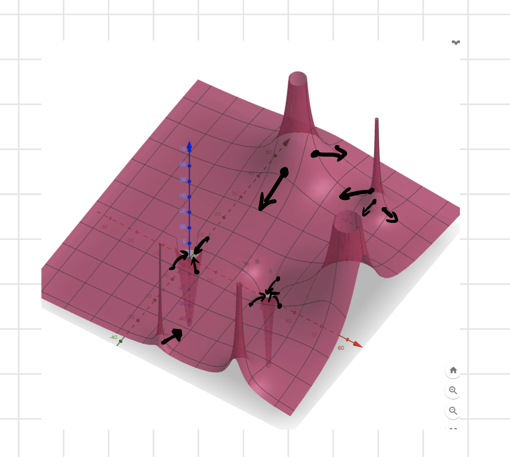
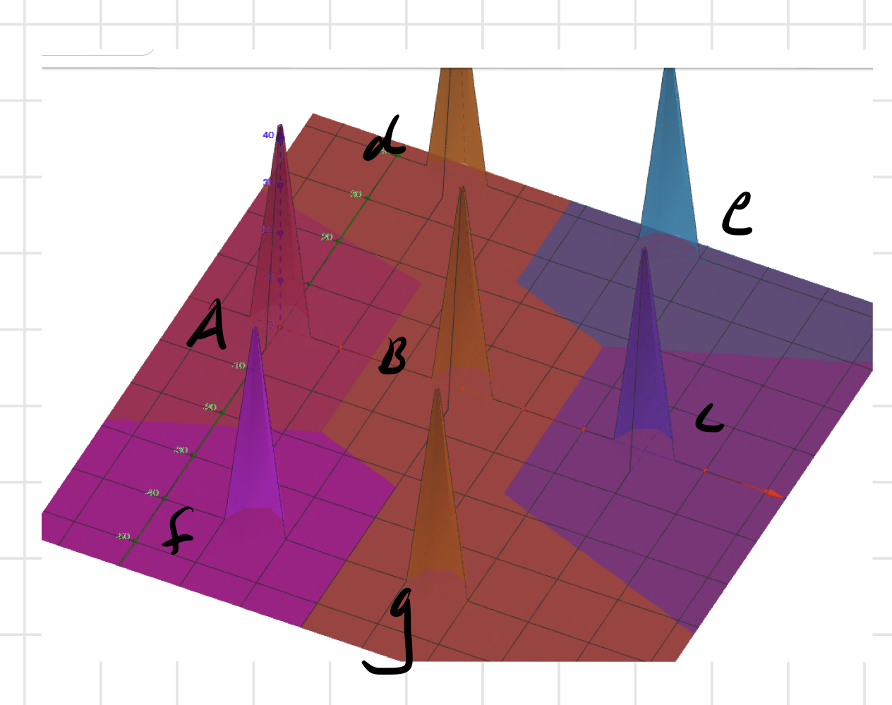
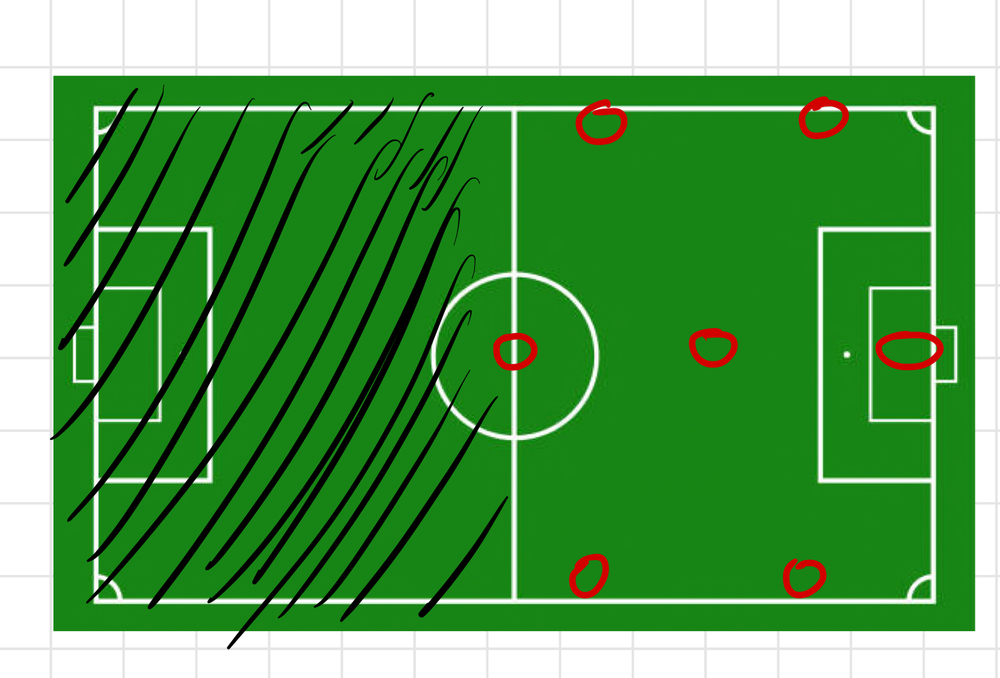
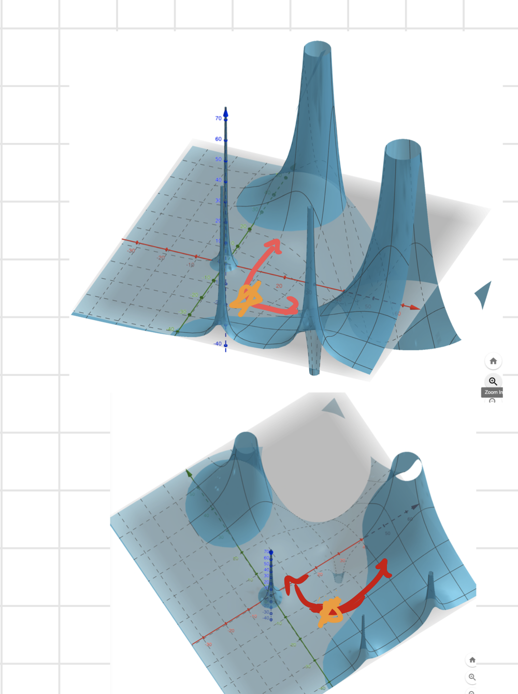
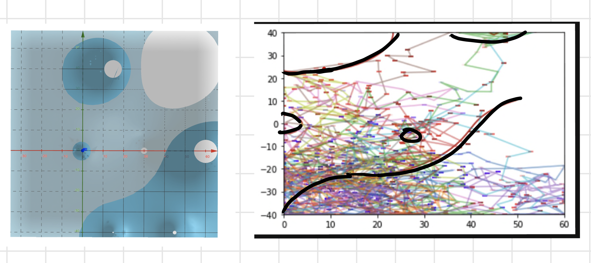

```{r setup, include=FALSE}
options(htmltools.dir.version = FALSE)


knitr::opts_chunk$set(
  fig.width=9, fig.height=3.5, fig.retina=3,
  out.width = "100%",
  cache = FALSE,
  echo = TRUE,
  message = FALSE, 
  warning = FALSE,
  fig.show = TRUE,
  hiline = TRUE
)
library(tidyverse)
library(SBpitch)

predata <- readRDS("SifanData/predata")
rw <- readRDS("SifanData/rw")

```


# Motivation

- To find a way to work with the data that does not ignore the locations of the other players.

- Expected Goals 

- Who will win? And other spatial-related questions.


---
## [StasbombR Data](https://github.com/statsbomb/StatsBombR)
```{r, echo=F}
DT::datatable(head(predata), fillContainer = FALSE, options = list(pageLength = 6))
```


####Data provided by [Statsbomb](https://github.com/statsbomb/open-data)

---

## Potential Function

- Idea: The ball is a randomly drifting ball that is attracted to the goal by some "force". 


--
- We can try to model this underlying force based on the movements of the ball


--
- $F = MA$


--
- $F = - \nabla V(x,y)$

---

## Our Potential Functions

- Gravity
$$ V(x,y) = -\frac{G}{\sqrt{x^2 + y^2}} $$


--
- **NOT** "potential of scoring".

.pull-left[

]

.pull-right[

]

---
## Our Potential Function (For Clarity Purporses)

.pull-left[
$$V(x, y) = \frac{g}{\sqrt{\left(x - 15\right)^{2} + \left(y + 40\right)^{2}}} +
\frac{f}{\sqrt{\left(x - 15\right)^{2} + \left(y - 40\right)^{2}}} - \\
\frac{e}{\sqrt{\left(x - 45\right)^{2} + \left(y + 40\right)^{2}}} - 
\frac{d}{\sqrt{\left(x - 45\right)^{2} + \left(y - 40\right)^{2}}} - \\
\frac{c}{\sqrt{y^{2} + \left(x - 30\right)^{2}}} + \frac{b }{\sqrt{y^{2} + \left(x - 60\right)^{2}}} + \frac{a}{\sqrt{x^{2} + y^{2}}}$$
]

---
## Random Walk

A path that consists of a succession of some random steps on some mathematical space.

- A point moves along the integer line

--

A random walk on the soccer filed

```{r, echo=F, warning = FALSE, message=FALSE}
rw.test <- rw(3000, .5, .5)
```


---
## Random Walk under Harmonic Potential Function
Using potential function as a guidance for random walk

--

- A step by the random particle under a force.
$$r(t_{i+1}) - r(t_i) = - \nabla V(r(t_i)) (t_{t+1} - t_i) + \sigma \sqrt{(t_{i+1} - t_i)} Z_{i+1}$$

--
<br>

- Small_Change = Estimated_Velocity x TimeStep + Noise 


---

# Estimating the Potential Function from a Trajectory of a Random Walk

The method is from [this paper](https://statistics.berkeley.edu/sites/default/files/tech-reports/723.pdf)

.pull-left[
- The underlying assumption 1: The potential function can approximated as a linear combination of basis functions

<br>


- Underlying assumption 2: The system is overdamped, so force affects the velocity, not acceleration. 


]

--
.pull-right[

]

---

### Estimating the Potential Function from a Trajectory of a Random Walk (Cont.)


- A step by the random particle under a force.
$$r(t_{i+1}) - r(t_i) = - \nabla V(r(t_i)) (t_{t+1} - t_i) + \sigma \sqrt{(t_{i+1} - t_i)} Z_{i+1}$$

--
<br>

- Small_Change = Estimated_Velocity x TimeStep + Noise 

<br>

With some additional tricks, we can write this as a linear regression problem that can be solved
via ordinary least squares algorithm (Appendix).

---

# Single Defensive Possession Example

.pull-left[
```{r, echo = FALSE, warning=FALSE, fig.height=8}
single_poss <- readRDS("NickData/single_poss794.rds")
single_poss %>% 
  ggplot(aes(x = x_coord, y_coord, color = idx, size = point_vel)) + 
  geom_point() +
  # scale_fill_gradient(low = "darkblue", high = "darkorange") +
   geom_segment(aes(
                xend=c(tail(x_coord, n=-1), NA), 
                yend=c(tail(y_coord, n=-1), NA)
              )
  ) + labs(title = "A single Defensive possession Trajectory") +
  theme(legend.position = "none")
```
]

.pull-right[

]

---

# Single Defensive Possession Example





---

# Why not KDE? 

--
- Kernel Density Estimation is a measure of aggregate locations

<br>

--
- The Potential Function is estimated from velocities
  - Estimates impact a hole has on the velocity by a coefficient

---

## Quick 3D + 2D demo on Liverpool WFC

https://cmsac-final-proj.herokuapp.com/


---

## Next Steps

--
- Take the Potential Functions of different teams (offensive behavior and defensive behavior)
  - Overlay offensive potential function over defensive potential function (across teams)  
  
  - Perform random walks (steps sampled from poisson dist.)
  
<br>

--
- Look at team formation based on potential function coefficients 

<br>

--
- How do potential functions look for possessions leading to shots?

---

### Estimating the Potential Function from a Trajectory of a Random Walk (Appendix)

Assuming 
$$r \in R^P$$

$$\nabla V(r) = \nabla \phi(r_i)^T \beta $$

$$r(t_{i+1}) - r(t_i) = - \nabla V(r(t_i)) (t_{t+1} - t_i) + \sigma \sqrt{(t_{i+1} - t_i)} Z_{i+1}$$

$$y_{i+1} = (r_{i+1} - r_i) / \sqrt{t_{i+1} - t_i}$$

$$y_{i+1} = -\nabla \phi (r_i)^T \beta \sqrt{t_{i+1} - t_i} + \sigma Z_{i+1}$$


Stack the $y_{i+1}, i=1,...,n$ to create $Y_n$ of vector size np x 1


Then stack $X_i = \nabla \phi(r_i)^T \sqrt{t_{i+1} - t_i}$ to create a matrix of np by L where L
is the number of basis functions.


Then we get the regression model:

$Y_n = X_n \beta + \epsilon_n$


