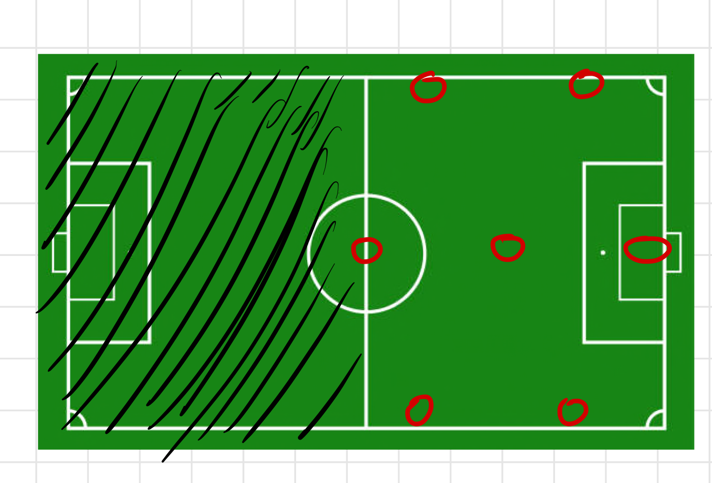
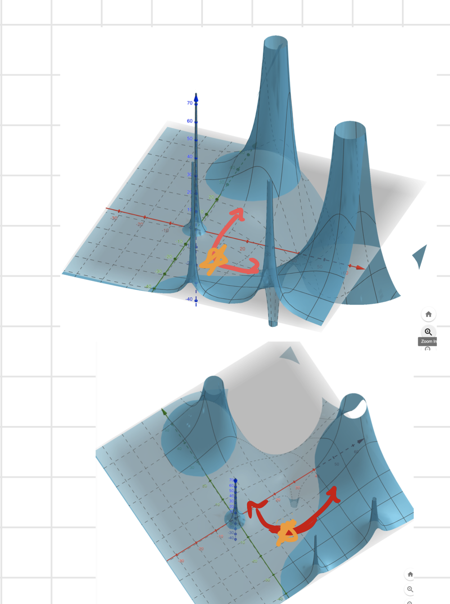
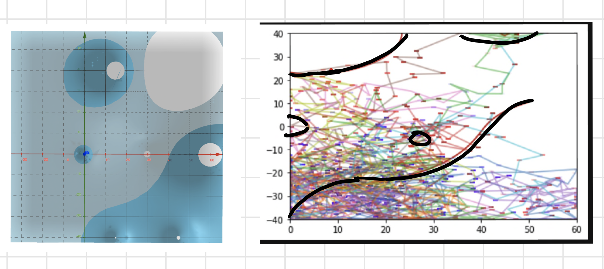

```{r setup, include=FALSE}
options(htmltools.dir.version = FALSE)
library(tidyverse)

```


# Motivation

- To find a way to work with the data that does not ignore the locations of the other players.

- Expected Goals 

- Who will win? And other spatial-related questions.

---


## Potential Function

- Idea: The ball is a randomly drifting ball that is attracted to the goal by some "force". 


--
- We can try to model this underlying force based on the movements of the ball


--
- $F = MA$


--
- $F = - \nabla V(x,y)$


--
- **NOT** "potential of scoring".


---

# Estimating the Potential Function from a Trajectory of a Random Walk

The method is from [this paper](https://statistics.berkeley.edu/sites/default/files/tech-reports/723.pdf)

.pull-left[
- The underlying assumption 1: The potential function can approximated as a linear combination of basis functions

<br>


- Underlying assumption 2: The system is overdamped, so force affects the velocity, not acceleration. 


]

--
.pull-right[

]

---

### Estimating the Potential Function from a Trajectory of a Random Walk (Cont.)


- Gravity
$$ V(x,y) = -\frac{G}{\sqrt{x^2 + y^2}} $$


- A step by the random particle under a force.
$$r(t_{i+1}) - r(t_i) = - \nabla V(r(t_i)) (t_{t+1} - t_i) + \sigma \sqrt{(t_{i+1} - t_i)} Z_{i+1}$$

--
<br>

- Small_Change = Estimated_Velocity x TimeStep + Noise 

<br>

With some additional tricks, we can write this as a linear regression problem that can be solved
via ordinary least squares algorithm (Appendix).

---

# Single Defensive Possession Example

.pull-left[
```{r, echo = FALSE, warning=FALSE}
single_poss <- readRDS("NickData/single_poss794.rds")
single_poss %>% 
  ggplot(aes(x = x_coord, y_coord, color = idx, size = point_vel)) + 
  geom_point() +
  # scale_fill_gradient(low = "darkblue", high = "darkorange") +
   geom_segment(aes(
                xend=c(tail(x_coord, n=-1), NA), 
                yend=c(tail(y_coord, n=-1), NA)
              )
  ) + labs(title = "A single Defensive possession Trajectory") +
  theme(legend.position = "none")
```
]

.pull-right[

]

---

# Single Defensive Possession Example





---

# Why not KDE? 

--
- Kernel Density Estimation is a measure of aggregate locations

--
- The Potential Function provides an estimate of velocities 


---

### Estimating the Potential Function from a Trajectory of a Random Walk (Cont.)

Assuming 
$$r \in R^P$$

$$\nabla V(r) = \nabla \phi(r_i)^T \beta $$

$$r(t_{i+1}) - r(t_i) = - \nabla V(r(t_i)) (t_{t+1} - t_i) + \sigma \sqrt{(t_{i+1} - t_i)} Z_{i+1}$$

$$y_{i+1} = (r_{i+1} - r_i) / \sqrt{t_{i+1} - t_i}$$

$$y_{i+1} = -\nabla \phi (r_i)^T \beta \sqrt{t_{i+1} - t_i} + \sigma Z_{i+1}$$


Stack the $y_{i+1}, i=1,...,n$ to create $Y_n$ of vector size np x 1


Then stack $X_i = \nabla \phi(r_i)^T \sqrt{t_{i+1} - t_i}$ to create a matrix of np by L where L
is the number of basis functions.


Then we get the regression model:

$Y_n = X_n \beta + \epsilon_n$


